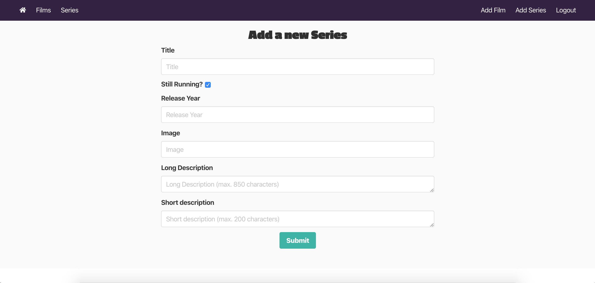

#  Project 2.5: MERN app

This is a website built in 1 week on which users can register, log in, add and comment on their favourite animated films and series. 

## Built with
* React
* Axios
* Express
* Node.js
* Sass
* Bulma
* Git
* GitHub

## Deployment
The website is deployed on Heroku and can be found [here](https://animated-api.herokuapp.com/).

## Getting started
Clone or download the repo. Run 'npm i' from the root directory to download all of the needed packages and then type 'npm run start'. The project will run on localhost:8000.

## Website architecture
The website consists of a home page, two index and show pages for films and series, a register and login page, and two pages to add new films or series. 

### 1. Home and Index pages


The home page consists of the name of the website and two buttons to go to either the film index page or the series index page. The main difference between the two index pages, is that the series page shows whether or not that particular series is still running. The film index page shows the director instead.

### 2. Show pages


The website has two different show pages, one for films and one for series. These pages show more information than the cards on the index page. The description is longer for example, and the release year of that film or series is shown. If the user has registered and is logged in, they can also write and delete their own comments.

### 3. Create pages



If users don't see a particular film or series, they can add it to the website. They will need to be logged in and provide the required information, such as the title, description and image. Because they are the creator of the film or series, they alone can update and/or delete it on the show page:

``` javascript
{userId === item.user && Auth.isAuthenticated() &&
  <div className="change-film">
    <div>
      <a onClick={handleEditItem} className="edit-btn"><FaRegEdit /></a>
      <p>Edit</p>
    </div>
    <div>
      <a onClick={handleDeleteItem} className="delete-btn"><FaRegTrashAlt /></a>
      <p>Delete</p>
    </div>
  </div>
}
```

## Wins and challenges 
* Creating this RESTful API was a very valuable experience. Because I made my own back-end and then added the front-end, I learned a lot about how the web works in general. After creating this website, I found it easier to work with third-party APIs as well as I now better understand how the requests of their data works.
* The first version of this website just focused on animated films. Because I added the series later it was difficult to change all the components I needed into generic components. The individual cards on the index page and the show pages are now the same for both films and series, but I didn't have time to also make the create and edit forms into reusable components.

## Future improvements
* I want to add likes and user profiles so that users can't just leave comments, but also like the films and series. They will be able to see their likes on their own profile, and it will also be possible to click on other users to see their profile and likes. This way, they will have a list of their favourite animated films and series. 
* Because this project was made in 1 week, I didn't have time to add a filter option on the index pages. I would like to add this in the future, so users can filter on for example the release year and the amount of likes and/or comments.